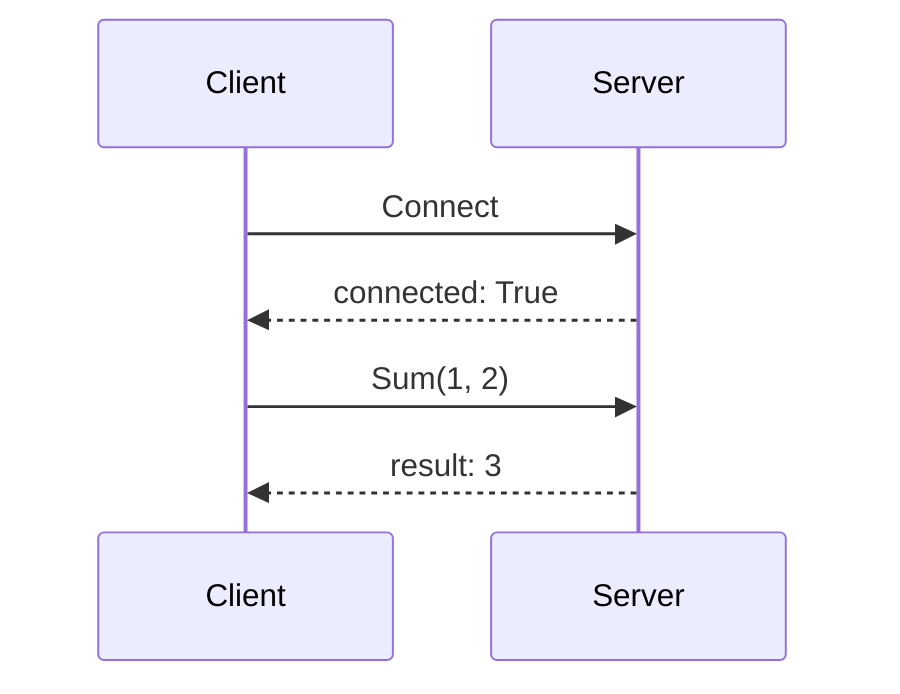

# TCP_ROM

TCP_ROM is multi process communication library


Enviroment: C#, .NET Standart 2.0

## Features
- Remote Object Mapping (through Interface)
- Easy to use
- Lightweight 
- BDD Tested

## Usage
### Step 1. Install from Nuget
Nuget package name: **TCP_ROM**

### Step 2. Define the same interface for Client and Server
```csharp
    using MultiProcessCommunicator;
    public interface ICalculator : IMpcService
    {
        int Sum(int a, int b);
    }
```

### Step 3. Implement interface for the Server side
```csharp
    public class ServerSideCalculator : ICalculator
    {
        public bool Connect(string host, int port){return true;}

        public void Disconnect(){}

        public int Sum(int a, int b)
        {
            return a + b;
        }
    }
```
### Step 4. Run Server
```csharp
    var port = 8888;
    var serverInstance = new ServerSideCalculator();
    MpcManager.CreateServer<ICalculator>(serverInstance, port);
```

### Step 5. Connect to remote Server
```csharp
    var port = 8888;
    var host = "localhost";
    var client = MpcManager.CreateClient<ICalculator>();
    if(!client.Connect(host, port))
    {
        // connection is not established
    }
```

### Step 6. Execute remote method
```csharp
    var result = client.Sum(1, 2);
    Console.WriteLine($"Result is: {result}");
```



## Perfomance
~15000 executes per second 


## License

Apache 2.0


